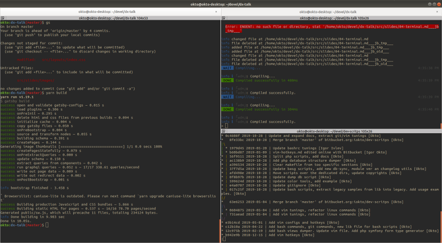

# Terminal
<p>
I use `Terminator` instead of native Ubuntu's one because it brings you an ability to split a single tab into several screens/splits. 
It saves screen space and decreases an amount of additional steps for switching tabs/windows — therefore it saves your nervous energy 😎.
</p>


--- 
It is useful to have a tab per _project_ with separated areas dedicated to some single purpose or _task_. 

For example, I have a `nodejs` project so there are:
+ A split with running node's dev-server
+ Another split with `webpack` watcher
+ The main split which I use for work with `git`
+ Some additional split for running `Storybook` when needed.
+ A special split for running `docker` which serves `Varnish` in the background

*Demonstration*

---
# Install
```shell script
sudo apt-get update
sudo apt-get install terminator
```
The only new shortcuts you have to learn are `Ctrl+Tab` and `Ctrl+Shift+Tab` — for navigation through the splits.

Then you could set Terminator as defaults in the Gnome settings and add it to the startup applications (with Gnome Tweaks tool).

*Demonstration*

---
# Hotkeys
I guess this is the one of the reasons why people scare of terminals: 
your `Ctrl+C`/`Ctrl+V` don't work anymore, as well as all other keys you know.

Let's familiarize ourselves with some minimal set of such must-known shortcuts.

See [terminal hotkeys](https://github.com/8kto/dev-scritps/blob/master/hotkeys/terminal.md) file.

*Demonstration*

---
Now, when we are armed with this basic knowledge, let's go deeper.
