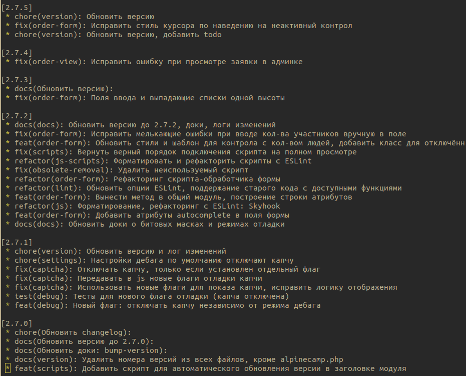

# $ Linux_
+ Smart history search
+ Shell
+ More about files in `bash/`
+ DB utils
+ Version utils

---
# Smart history search
This is incredibly useful for retrieving commands you’ve used previously and makes a huge difference to your productivity.
See how to configure it [here](https://github.com/8kto/dev-scritps/blob/master/env/tunings.md#smart-incremental-history-search).

*Demonstration*

This functionality is available in all applications that use Readline including MySQL, Python, IRB (interactive Ruby shell) and others. 
Once you’re used to this feature, it’s hard to live without.

---
Another way of searching your history is to use `CTRL+R`, which essentially performs a full-text search on your history (keep pressing `CTRL+R` to cycle through results). In this case, searching for “ssh” will locate all commands that feature this string anywhere in the command.

*Demonstration*

---
*Side note*: place space in the front of the command to hide it from the history.

*Demonstration*

---
# Shell 🐚
+ [Misc tunings in profile files](https://github.com/8kto/dev-scritps/blob/master/env/tunings.md)
+ [Install `z` util for quick navigation](https://github.com/rupa/z/blob/master/README#L48)
+ [Some advanced shell commands](https://github.com/8kto/dev-scritps/blob/master/bash/useful-commands.sh) — not really for every-day using, but still applicable🐚🐚

*Demonstration*

---
# More about files in `bash/`
+ `lib.sh` Common utils which could be shared between some set of scripts in your project
+ `lib-text-colors-tools.sh` Utils for displaying lines, colors and positioned text

Examples live here:
```  
examples
  ├── color-tools.sh    # How to use tools from lib-text-colors-tools.sh
  └── progressbar.sh    # How to use progress bars in your shell scripts
```

*Demonstration*

---
# DB utils
Bit specific scripts, but pretty common used in my projects — so I extracted it and placed here.
```
db
  ├── dump-db-routine.sh
  ├── dump-db.sh
  ├── recreate-test-db.sh
  └── sync-test-db.sh
```

---
# Versions
These kids help you with versioning and stuff:
+ `bump-module-version.sh`
+ `generate-changelog.sh`

---
`bump-module-version.sh`  Used for bumping versions in desired file (__1.4 => 1.5__, __1.4 => 2__ and so on). Uses [bumpversion](https://pypi.org/project/bumpversion/) under the hood.

*Demonstration*

---
`generate-changelog.sh` Generates a fancy looking changelog based on git tags


