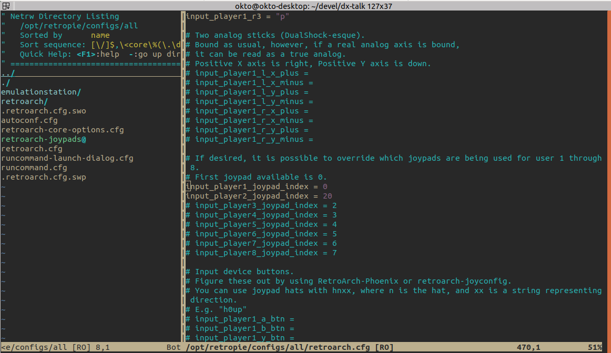

# Vim

Next, let's talk about CLI editor `vim`.

--- 
Bare installation looks very simple. Though it is already ready to use, we could enhance it with its native file explorer and some other adjustments.
+ [Configuration](https://github.com/8kto/dev-scritps/blob/master/env/vim/vimrc.md)

---
First of all, you have to learn a single command to quit it ;)
+ [Hotkeys](https://github.com/8kto/dev-scritps/blob/master/hotkeys/vim.md) 

